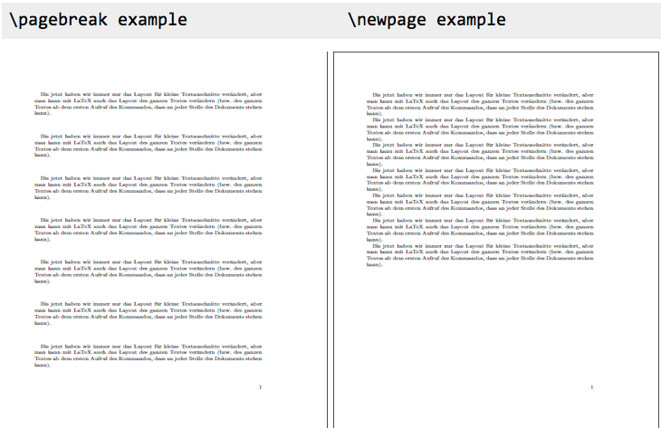

# $\LaTeX$ (Cheat Sheet)

## Breaks

Source: [ceu.hu](http://www.personal.ceu.hu/tex/breaking.htm)

The first thing LaTeX does when processing ordinary text is to translate your input file into a 
string of glyphs and spaces. To produce a printed document, this string must be broken into lines, 
and these lines must be broken into pages. In some environments, you do the line breaking yourself with the \\\\ command, but LaTeX usually does it for you. The available commands are

+   [`\\`](http://www.personal.ceu.hu/tex/breaking.htm#linebr) start a new paragraph.
+   [`\\*`](http://www.personal.ceu.hu/tex/breaking.htm#linebr) start a new line but not a new 
	paragraph.
+   [`\-`](http://www.personal.ceu.hu/tex/breaking.htm#hyph) OK to hyphenate a word here.
+   [\cleardoublepage](http://www.personal.ceu.hu/tex/breaking.htm#clrdblpage) flush all material 
	and start a new page, start new odd numbered page.
+   [\clearpage](http://www.personal.ceu.hu/tex/breaking.htm#clrpage) plush all material and start 
	a new page.
+   [\hyphenation](http://www.personal.ceu.hu/tex/breaking.htm#hyphw) enter a sequence of 
	exceptional hyphenations.
+   [\linebreak](http://www.personal.ceu.hu/tex/breaking.htm#linebreak) allow to break the line 
	here.
+   [\newline](http://www.personal.ceu.hu/tex/breaking.htm#newline) request a new line.
+   [\newpage](http://www.personal.ceu.hu/tex/breaking.htm#newpage) request a new page.
+   [\nolinebreak](http://www.personal.ceu.hu/tex/breaking.htm#nolinebreak) no line break should 
	happen here.
+   [\nopagebreak](http://www.personal.ceu.hu/tex/breaking.htm#nopagebreak) no page break should 
	happen here.
+   [\pagebreak](http://www.personal.ceu.hu/tex/breaking.htm#pagebreak) encourage page break.

### `\\`


```tex
\\[*][extra-space]
```

The `\\` command tells LaTeX to start a new line. It has an optional argument, extra-space, that specifies how much extra vertical space is to be inserted before the next line. This can be a negative amount.
The `\\*` command is the same as the ordinary `\\` command except that it tells LaTeX not to start a new page after the line.

### `\-`

The `\-` command tells LaTeX that it may hyphenate the word at that point. LaTeX is very good at 
hyphenating, and it will usually find all correct hyphenation points. The `\-` command is used for 
the exceptional cases, as e.g.

```tex
man\-u\-script
```

### `\cleardoublepage`

The `\cleardoublepage` command ends the current page and causes all figures and tables that have so 
far appeared in the input to be printed. In a two-sided printing style, it also makes the next page 
a right-hand (odd-numbered) page, producing a blank page if necessary.

### `\clearpage`

The \clearpage command ends the current page and causes all figures and tables that have so far 
appeared in the input to be printed.

### `\hyphenation`

```tex
\hyphenation{words}
```

The `\hyphenation` command declares allowed hyphenation points, where words is a list of words, 
separated by spaces, in which each hyphenation point is indicated by a `-` character, e.g.

```tex
\hyphenation{man-u-script man-u-stripts ap-pen-dix}
```

### `\linebreak`

```tex
\linebreak\[number]
```

The `\linebreak` command tells LaTeX to break the current line at the point of the command. 
With the optional argument, number, you can convert the `\linebreak` command from a demand to a 
request. The number must be a number from 0 to 4. The higher the number, the more insistent the 
request is.

The `\linebreak` command causes LaTeX to stretch the line so it extends to the right margin.

### `\newline`

The `\newline` command breaks the line right where it is. The `\newline` command can be used 
only in paragraph mode.

### `\newpage`

The `\newpage` command ends the current page.

### `\pagebreak`

```tex
\pagebreak\[number]
```

The `\pagebreak` command tells LaTeX to break the current page at the point of the command. 
With the optional argument, number, you can convert the `\pagebreak` command from a demand to a 
request. The number must be a number from 0 to 4. The higher the number, the more insistent the 
request is.

> If you use `\newpage`, the page will be directly "cut off" and a new one will begin. The 
> text/paragraphs on the page will not be affected in any way. If you do this, you might have a lot 
> of empty space on that page.
> 
> With `\pagebreak`, the paragraphs on the cut page will spread out over the page, so you will not 
> have empty space at the bottom. The old page will not look like it is the end of a chapter.
> 
> Here is an example of the results of a `\pagebreak` and a `\newpage` (the pictures show the page 
> on which the command was written. The commands are written at the end of each page to start a new 
> one.):
> 
> 

Source: [stackoverflow.com](https://tex.stackexchange.com/a/9855)

### `\nolinebreak`

```tex
\nolinebreak\[number]
```
The `\nolinebreak` command prevents LaTeX from breaking the current line at the point of the command. With the optional argument, number, you can convert the `\nolinebreak` command from a demand to a request. The number must be a number from 0 to 4. The higher the number, the more insistent the request is.

### \nopagebreak

```tex
\nopagebreak\[number]
```

The `\nopagebreak` command prevents LaTeX form breaking the current page at the point of the command. With the optional argument, number, you can convert the `\nopagebreak` command from a demand to a request. The number must be a number from 0 to 4. The higher the number, the more insistent the request is.

