# $\LaTeX$ (Cheat Sheet)

## Text formatting


Italic:

```tex
\textit{code coverage}
```

Bold:

```tex
\textbf{code coverage}
```

Monospace (like `code` in Markdown):

```tex
\texttt{code}
```

> The `\texttt` command typesets its argument in teletype font (sometimes called typewriter or 
> monospace font). The trailing `tt` is an abbreviation for **t**ele**t**ype.

Source: [tex.stackexchange.com](https://tex.stackexchange.com/a/470806)

## Citations

In text citation:

```tex
...
\usepackage[square,numbers]{natbib}
\bibliographystyle{agsm}
% Provides bibliography functionality

\begin{document}

...
\citep{buterin_2014_ethereum}

...
\bibliography{bibliography.bib}

...
\end{document}
```

With `.bib` file (e.g. `bibliography.bib`):

```bibtex
@misc{buterin_2014_ethereum,
  author = {Buterin, Vitalik},
  title = {Ethereum: A Next-Generation Smart Contract and Decentralized Application Platform},
  urldate = {2023-05-21},
  year = {2014}
}
```

Renders as:

```txt
...
Example citation [1].
...

References

[1] Buterin, V. [2014], ‘Ethereum: A next-generation smart contract and
decentralized application platform’.
```

Display date as round bracket $\text{(2015)}$ instead of default square brackets $\text{[2015]}$:

```tex
\setcitestyle{round} 
```

Renders as:

```txt
[2] Jones, M. B., Bradley, J. and Sakimura, N. (2015), JSON Web Token (JWT), Technical Report 7519.
URL: https: // www. rfc-editor. org/ info/ rfc7519
```

Clickable URLs in `@misc` entries:

```bibtex
@Misc{Infura,
  author = {Infura},
  title  = {Ethereum API},
  year   = {2023},
  url    = {\url{https://www.infura.io/}},
}
```

Made as follows in JabRef:

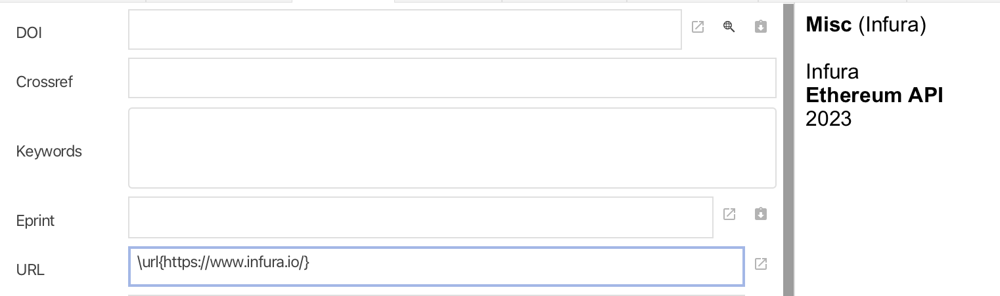

Requires `\usepackage{hyperref}` in the preamble.

```tex
\usepackage[
	colorlinks,
	urlcolor=blue
]{hyperref}
```

Renders as follows:

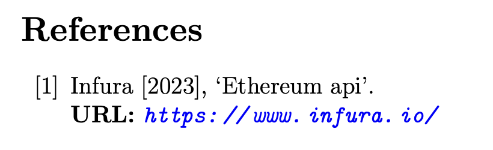

## Package: `hyperref` options

### Linking style options from Overleaf

Source: [overleaf.com](https://www.overleaf.com/learn/latex/Hyperlinks)

| Option | Default value | Description |
| --- |  --- |  --- |
| `hyperindex` | true | Makes the page numbers of index entries into hyperlinks |
| `linktocpage` | false | Makes the page numbers instead of the text to be link in the Table of contents. |
| `breaklinks` | false | Allows links to be broken into multiple lines. |
| `colorlinks` | false | Colours the text for links and anchors, these colours will appear in the printed version |
| `linkcolor` | red | Colour for normal internal links |
| `anchorcolor` | black | Colour for anchor (target) text |
| `citecolor` | green | Colour for bibliographical citations |
| `filecolor` | cyan | Colour for links that open local files |
| `urlcolor` | magenta | Colour for linked URLs |
| `frenchlinks` | false | Use small caps instead of colours for links |

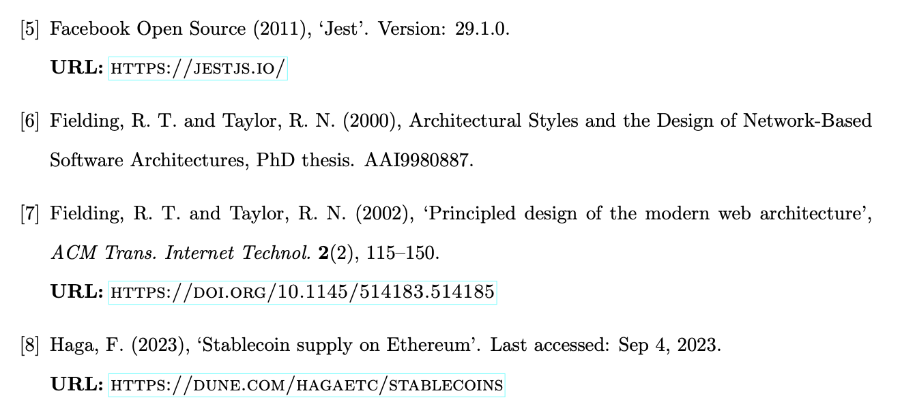

### PDF-specific options from Overleaf

Source: [overleaf.com](https://www.overleaf.com/learn/latex/Hyperlinks)

Links in a document are created having in mind a document that will be read in PDF format. 
The PDF file can be further personalized to add additional information and change the way the 
PDF viewer displays it. Below an example:

```tex
\hypersetup{
    colorlinks=true,
    linkcolor=blue,
    filecolor=magenta,
    urlcolor=cyan,
    pdftitle={Overleaf Example},
    pdfpagemode=FullScreen,
}
```
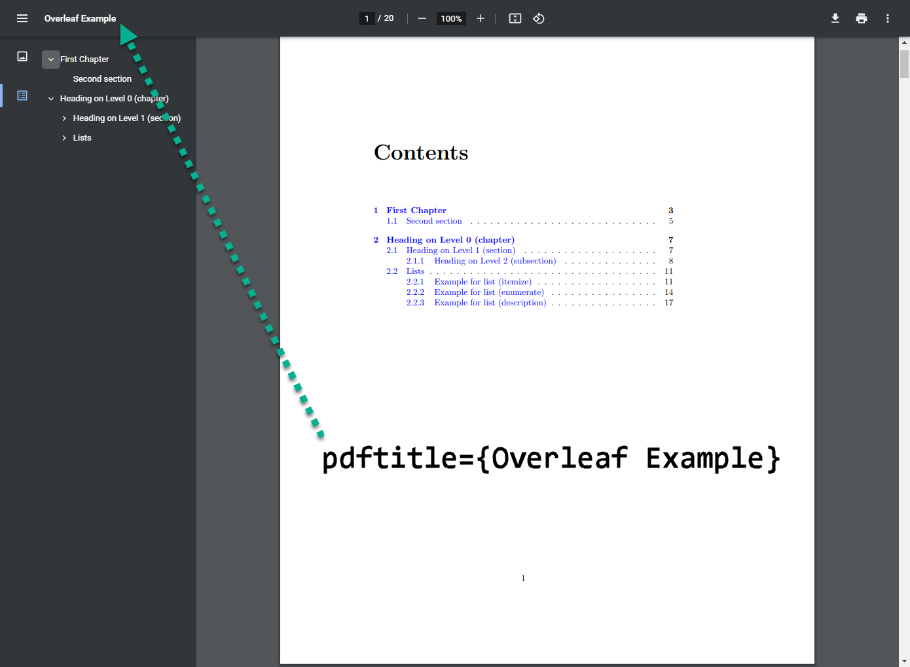

| Option | Default value | Description |
| --- |  --- |  --- |
| `bookmarks` | true | Acrobat bookmarks are written, similar to the table of contents. |
| `bookmarksopen` | false | Bookmarks are shown with all sub-trees expanded. |
| `citebordercolor` | 0 1 0 | Colour of the box around citations in RGB format. |
| `filebordercolor` | 0 .5 .5 | Colour of the box around links to files in RGB format. |
| `linkbordercolor` | 1 0 0 | Colour of the box around normal links in RGB format. |
| `menubordercolor` | 1 0 0 | Colour of the box around menu links in RGB format. |
| `urlbordercolor` | 0 1 1 | Colour of the box around links to URLs in RGB format. |
| `pdfpagemode` | empty | Determines how the file is opened. Possibilities are UseThumbs (Thumbnails), UseOutlines (Bookmarks) and FullScreen. |
| `pdftitle` |  | Sets the document title. |
| `pdfauthor` |  | Sets the document Author. |
| `pdfstartpage` | 1 | Determines on which page the PDF file is opened. |

### Wikibooks link styling options

For more detailed setup options see: [wikibooks.org](https://en.wikibooks.org/wiki/LaTeX/Hyperlinks)

### Stackexchange styling options (TLDR)

Source: 
[tex.stackexchange.com](https://tex.stackexchange.com/questions/50747/options-for-appearance-of-links-in-hyperref)

> if you use `colorlinks=true` you can set (defaults in \[\]):
> 
> -   `linkcolor` \[red\]
> -   `anchorcolor` \[black\]
> -   `citecolor` \[green\]
> -   `filecolor` \[cyan\]
> -   `menucolor` \[red\]
> -   `runcolor` \[cyan - same as file color\]
> -   `urlcolor` \[magenta\]
> -   `allcolors` \-- use this if you want to set all links to the same color
> 
> if you want some of these not coloured, simply set them to `.` (e.g., `citecolor=.`), which will
> use the color of the text where the link appears.
> 
> if you use `colorlinks=false` and therefore want the frames around the links you have access to 
> these settings:
> 
> -   `citebordercolor` \[rgb 0 1 0\]
> -   `filebordercolor` \[rgb 0 .5 .5\]
> -   `linkbordercolor` \[rgb 1 0 0\]
> -   `menubordercolor` \[rgb 1 0 0\]
> -   `urlbordercolor` \[rgb 0 1 1\]
> -   `runbordercolor` \[rgb 0 .7 .7\]
> -   `allbordercolors`
> 
> again if you want some of these to not appear, set them to white.
> 
> In your case, if you want the frames around links in citations but not on the table of content 
> (and therefore not on other links such as to figures, tables or footnotes) I suggest you have 
> a `\hypersetup` configuration with at least:
> 
> ```tex
> \usepackage{hyperref}
> \hypersetup{
>     colorlinks = false,
>     linkbordercolor = {white},
>     <your other options...>,
> }
> ```

## Bibliography management

Recommended: [jabref.org](https://www.jabref.org/) (open source and 
	[recommended by MIT](https://libguides.mit.edu/cite-write/bibtex#:~:text=If%20you%20primarily,Started%20guidance.))

Save library as `bibliography.bib` directly into LaTeX project directory and specify 
`\bibliography{bibliography.bib}` in the `main.tex` file to avoid compile errors due to temporary
files such as `bibliography.bib.sav` created by JabRef.

```tex
\bibliography{bibliography.bib}
```

Use Google Scholar to search for articles, copy the BibTeX citation to clipboard and paste into
JabRef.

Other:

+	[mybib.com](https://www.mybib.com/) (recommended, free, browser-based and `.bib` file export),
+	[citethis.net](https://citethis.net/Harvard) (no `.bib` file), or
+	[easybib.com](https://www.easybib.com/) (owned by Chegg and premium only).


## Abstract

Source: [silmaril.ie](http://latex.silmaril.ie/formattinginformation/abstracts.html)

> In reports and articles it is usual for the author to provide an Summary or Abstract, which 
> describes the content and explains its importance. Abstracts in articles are usually only a 
> couple of paragraphs long. Summaries in reports or theses can run to several pages, depending on 
> the length and complexity of the document or the readership it’s aimed at.

```tex
\begin{abstract}
This is my abstract
\end{abstract}
```

## Breaks

Source: [ceu.hu](http://www.personal.ceu.hu/tex/breaking.htm)

The first thing LaTeX does when processing ordinary text is to translate your input file into a 
string of glyphs and spaces. To produce a printed document, this string must be broken into lines, 
and these lines must be broken into pages. In some environments, you do the line breaking yourself with the \\\\ command, but LaTeX usually does it for you. The available commands are

+   [`\\`](http://www.personal.ceu.hu/tex/breaking.htm#linebr) start a new paragraph.
+   [`\\*`](http://www.personal.ceu.hu/tex/breaking.htm#linebr) start a new line but not a new 
	paragraph.
+   [`\-`](http://www.personal.ceu.hu/tex/breaking.htm#hyph) OK to hyphenate a word here.
+   [\cleardoublepage](http://www.personal.ceu.hu/tex/breaking.htm#clrdblpage) flush all material 
	and start a new page, start new odd numbered page.
+   [\clearpage](http://www.personal.ceu.hu/tex/breaking.htm#clrpage) plush all material and start 
	a new page.
+   [\hyphenation](http://www.personal.ceu.hu/tex/breaking.htm#hyphw) enter a sequence of 
	exceptional hyphenations.
+   [\linebreak](http://www.personal.ceu.hu/tex/breaking.htm#linebreak) allow to break the line 
	here.
+   [\newline](http://www.personal.ceu.hu/tex/breaking.htm#newline) request a new line.
+   [\newpage](http://www.personal.ceu.hu/tex/breaking.htm#newpage) request a new page.
+   [\nolinebreak](http://www.personal.ceu.hu/tex/breaking.htm#nolinebreak) no line break should 
	happen here.
+   [\nopagebreak](http://www.personal.ceu.hu/tex/breaking.htm#nopagebreak) no page break should 
	happen here.
+   [\pagebreak](http://www.personal.ceu.hu/tex/breaking.htm#pagebreak) encourage page break.

### `\\`


```tex
\\[*][extra-space]
```

The `\\` command tells LaTeX to start a new line. It has an optional argument, extra-space, that specifies how much extra vertical space is to be inserted before the next line. This can be a negative amount.
The `\\*` command is the same as the ordinary `\\` command except that it tells LaTeX not to start a new page after the line.

### `\-`

The `\-` command tells LaTeX that it may hyphenate the word at that point. LaTeX is very good at 
hyphenating, and it will usually find all correct hyphenation points. The `\-` command is used for 
the exceptional cases, as e.g.

```tex
man\-u\-script
```

### `\cleardoublepage`

The `\cleardoublepage` command ends the current page and causes all figures and tables that have so 
far appeared in the input to be printed. In a two-sided printing style, it also makes the next page 
a right-hand (odd-numbered) page, producing a blank page if necessary.

### `\clearpage`

The \clearpage command ends the current page and causes all figures and tables that have so far 
appeared in the input to be printed.

### `\hyphenation`

```tex
\hyphenation{words}
```

The `\hyphenation` command declares allowed hyphenation points, where words is a list of words, 
separated by spaces, in which each hyphenation point is indicated by a `-` character, e.g.

```tex
\hyphenation{man-u-script man-u-stripts ap-pen-dix}
```

### `\linebreak`

```tex
\linebreak\[number]
```

The `\linebreak` command tells LaTeX to break the current line at the point of the command. 
With the optional argument, number, you can convert the `\linebreak` command from a demand to a 
request. The number must be a number from 0 to 4. The higher the number, the more insistent the 
request is.

The `\linebreak` command causes LaTeX to stretch the line so it extends to the right margin.

### `\newline`

The `\newline` command breaks the line right where it is. The `\newline` command can be used 
only in paragraph mode.

### `\newpage`

The `\newpage` command ends the current page.

### `\pagebreak`

```tex
\pagebreak\[number]
```

The `\pagebreak` command tells LaTeX to break the current page at the point of the command. 
With the optional argument, number, you can convert the `\pagebreak` command from a demand to a 
request. The number must be a number from 0 to 4. The higher the number, the more insistent the 
request is.

> If you use `\newpage`, the page will be directly "cut off" and a new one will begin. The 
> text/paragraphs on the page will not be affected in any way. If you do this, you might have a lot 
> of empty space on that page.
> 
> With `\pagebreak`, the paragraphs on the cut page will spread out over the page, so you will not 
> have empty space at the bottom. The old page will not look like it is the end of a chapter.
> 
> Here is an example of the results of a `\pagebreak` and a `\newpage` (the pictures show the page 
> on which the command was written. The commands are written at the end of each page to start a new 
> one.):
> 
> 

Source: [stackoverflow.com](https://tex.stackexchange.com/a/9855)

### `\nolinebreak`

```tex
\nolinebreak\[number]
```
The `\nolinebreak` command prevents LaTeX from breaking the current line at the point of the command. With the optional argument, number, you can convert the `\nolinebreak` command from a demand to a request. The number must be a number from 0 to 4. The higher the number, the more insistent the request is.

### \nopagebreak

```tex
\nopagebreak\[number]
```

The `\nopagebreak` command prevents LaTeX form breaking the current page at the point of the command. With the optional argument, number, you can convert the `\nopagebreak` command from a demand to a request. The number must be a number from 0 to 4. The higher the number, the more insistent the request is.

## Todos in LaTeX documents with the `todo` package

Source: [ctang.org](https://ctan.org/tex-archive/macros/latex/contrib/todo)

```tex
\usepackage{todo}
\begin{document}

Hello this command is creating two todos \todo{Just showing.}.
\todo{Fixing the bug}
This next command is  creating a todo with an optional text argument \todo[Ex.]{Optional argument.}.

This is an exmaple todo that is done \done\todo{Example of a todo that has been `done'}

\todos % This command adds the list of all the todos in the document.

\end{document} 
```

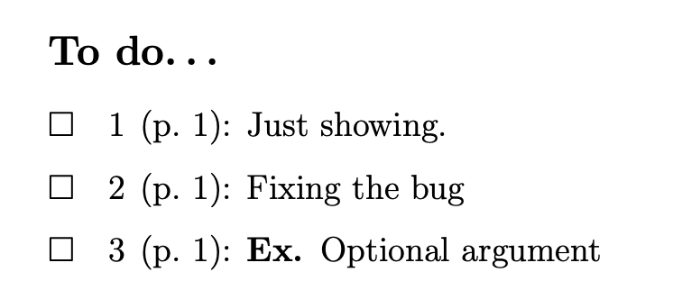

Source: [ox.ac.uk](https://mirror.ox.ac.uk/sites/ctan.org/macros/latex/contrib/todo/todo-spl.pdf)

## Figures

Using the `graphicx` package:

```tex
...
\usepackage{graphicx}
% Provides image/figure/graphics display functionality (with files in assets/images/*)

\begin{document}

...
\begin{figure}[ht]
    \includegraphics[width=\textwidth]{assets/images/request-flow.drawio.png}
    \caption{Illustrative architecture diagram}
    \centering
    \label{fig:request-flow}
\end{figure}

...
\end{document}
```

Renders as:

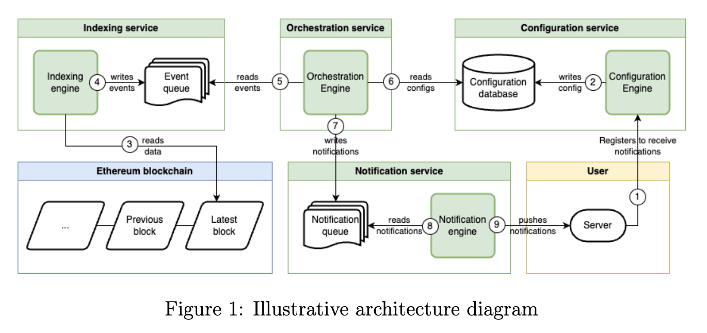


```tex
\begin{figure}[h]
	\centering
	\includegraphics[scale=0.1]{bbk-logo.png}
\end{figure}
```

Renders as:


## Wrapped figures using `wrapfig`

Source: [overleaf.com](https://www.overleaf.com/learn/latex/Wrapping_text_around_figures)

```tex
\usepackage{wrapfig}
```

This makes the *wrapfigure* environment available to us, and we can put a `\includegraphics` 
command inside it to create a figure around which text will be wrapped. Here is how we can specify a *wrapfigure* environment:

```tex
\begin{wrapfigure}[lineheight]{position}{width}
  ...
\end{wrapfigure}
```

The *position* parameter has eight possible values:

| r | R | right side of the text |
| --- |  --- |  --- |
| l | L | left side of the text |
| i | I | inside edge--near the binding (in a *twoside* document) |
| o | O | outside edge--far from the binding |

The uppercase version allows the figure to float. The lowercase version means *exactly here*.

Here is an example:

```tex
\begin{wrapfigure}{r}{0.6\textwidth}
	\centering
	\includegraphics[width=0.58\textwidth]{assets/images/configuration-table-api-endpoints.png}
	\caption{Birds}
\end{wrapfigure}
```

It may be noted that the width of the image included was specified relative to width of the text 
()`\textwidth`). It is a good idea to use relative sizes to define lengths (height, width, etc), 
particularly when using *wrapfigure*.

In the example above, the figure covers exactly half of the the textwidth, and the actual image 
uses a slightly smaller width, so that there is a pleasing small white frame between the image 
and the text. The image should always be smaller (less wide) than the wrap, or it will overrun 
the text.

Take care while using adding *wrapfigures* very near the top or bottom of a page, as this can 
often cause unwanted effects that are hard or near-impossible to solve. It is not advisable to 
try to use *wrapfigures* alongside equations or sectional headers. They also cannot be used in 
lists, such as `itemize` and `enumerate` environments.

## Colours with the `xcolor` package

```tex
\usepackage{xcolor}
```

## Numbered list with the `enumerate` package

Source: [ctan.org](https://ctan.org/pkg/enumerate)
Documentation: 
[warwick.ac.uk](https://anorien.csc.warwick.ac.uk/mirrors/CTAN/macros/latex/required/tools/enumerate.pdf)

An occurrence of one of the tokens A a I i or 1 produces the value of the counter printed with 
(respectively) `\Alph` `\alph` `\Roman` `\roman` or `\arabic`. 

These letters may be surrounded by any strings involving any other TEX expressions, however the 
tokens A a I i 1 must be inside a `{ }` group if they are not to be taken as special.

```tex
\begin{enumerate}[EX i.]
	\item one one one one one one one
		one one one one\label{LA}
	\item two
	\begin{enumerate}[{example} a)]
		\item one of two one of two
			one of two\label{LB}
		\item two of two
	\end{enumerate}
\end{enumerate}

\begin{enumerate}[{A}-1]
	\item one\label{LC}
	\item two
\end{enumerate}
```

Renders as:

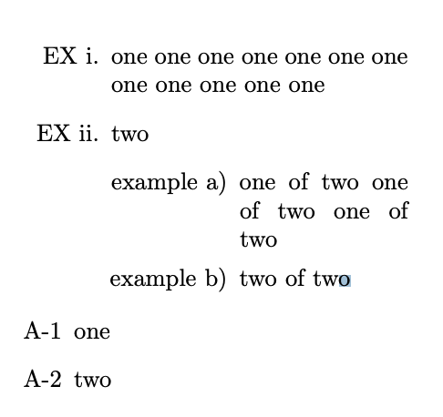

## Fractions

The simplest commands for writing fractions are `\frac{n}{d}` and `\dfrac{n}{d}`, in which "n" 
is the numerator and "d" is the denominator.

Source: https://opentextbc.ca/pressbooks/chapter/how-do-i-write-a-fraction-in-latex/

## Glossary with `glossaries` package

Source: [overleaf.com](https://www.overleaf.com/learn/latex/Glossaries)

> For the glossary to show up in the table of contents put

```tex
\usepackage[toc]{glossaries}
```

Usage:

```tex
\documentclass{article}
\usepackage[utf8]{inputenc}
\usepackage{glossaries}

\makeglossaries

\newglossaryentry{latex}
{
    name=latex,
    description={Is a markup language specially suited 
    for scientific documents}
}

\newglossaryentry{maths}
{
    name=mathematics,
    description={Mathematics is what mathematicians do}
}

\title{How to create a glossary}
\author{ }
\date{ }

\begin{document}
\maketitle

The \Gls{latex} typesetting markup language is specially suitable 
for documents that include \gls{maths}. 

\clearpage

\printglossaries

\end{document}
```

Renders as:

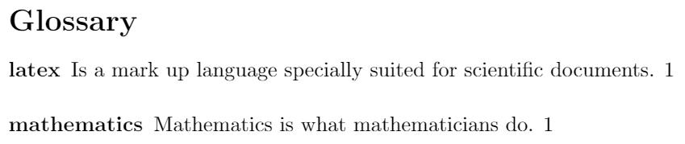

> Usually there are two types of entries in a glossary: terms and their definitions, or acronyms 
> and their meaning. This two types can be printed separately in your LATEX document.

```tex
\documentclass{article}
\usepackage[utf8]{inputenc}
\usepackage[acronym]{glossaries}

\makeglossaries

\newglossaryentry{latex}
{
        name=latex,
        description={Is a mark up language specially suited for 
scientific documents}
}

\newglossaryentry{maths}
{
        name=mathematics,
        description={Mathematics is what mathematicians do}
}

\newglossaryentry{formula}
{
        name=formula,
        description={A mathematical expression}
}

\newacronym{gcd}{GCD}{Greatest Common Divisor}

\newacronym{lcm}{LCM}{Least Common Multiple}

\begin{document}

The \Gls{latex} typesetting markup language is specially suitable 
for documents that include \gls{maths}. \Glspl{formula} are 
rendered properly an easily once one gets used to the commands.

Given a set of numbers, there are elementary methods to compute 
its \acrlong{gcd}, which is abbreviated \acrshort{gcd}. This 
process is similar to that used for the \acrfull{lcm}.

\clearpage

\printglossary[type=\acronymtype]

\printglossary

\end{document}
```

Renders as:

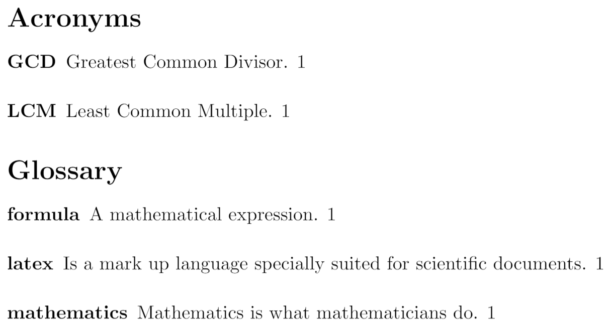

Fix glossary not printing:

> For a **quick, easy solution** change `\makeglossaries` to `\makenoidxglossaries` and 
> `\printglossaries` to `\printnoidxglossaries`.
> 
> This is a bit slower than the usual commands without `noidx`, but it's no problem unless you have 
> a huge glossary.

Source: [tex.stackexchange.com](https://tex.stackexchange.com/a/249693)

## Spacing between lines with `setspace` package

Source: [mit.edu](http://kb.mit.edu/confluence/pages/viewpage.action?pageId=3907092)

To double space a LaTeX document, you should include the line

```tex
\usepackage{setspace}
```

after your `\documentclass` line.

Before your `\begin{document}` command,

```tex
\doublespacing
```

will make the text of the whole document double spaced. Footnotes, figures, and tables will 
still be singlespaced, however. For one-and-a-half spacing, instead use the command

```tex
\onehalfspacing
```

In order to make a part of the text of your document singlespaced, you can put:

```tex
\begin{singlespace}
```

at the beginning of the text you want singlespaced, and

```tex
\end{singlespace}
```

at the end.

You can also set the spacing to be something other than doublespaced; for
example, if you wanted to have one-and-a-quarter spacing between lines,
use the line

```tex
\setstretch{1.25}
```

before your `\begin{document}` command, and after the `\usepackage{setspace}` line.

```tex
\usepackage[nodisplayskipstretch]{setspace}

```

## Remove numbering from section headings with package

Source: [overleaf.com](https://www.overleaf.com/learn/latex/Questions/How_do_I_remove_the_numbers_from_section_headings%3F)

If you'd prefer your sections, subsection, and so forth to be displayed without numbers on the 
left side of the title, you simply add a \* symbol to the command. (Note that section headings 
created this way will not be listed in the table of contents `\tableofcontents`.)

For example, you can get a section without a number using the following command:

```tex
\section\*{Your section title}
```

## Specify where to break words

Source: [tex.stackexchange.com](https://tex.stackexchange.com/a/121835)

-   use `\-` inside a word to explicitly denote the allowed places to break, e.g. `cryp\-to\-graphy`

-   specify hyphen exceptions via `\hyphenation{cryp-to-graphy}` (normally in the document 
	preamble). If done then the word `cryptography` used in the document will allow hyphenation at 
	the points indicated by the `-`. Note that only the exact form of the word is affected, if you 
	use different form, eg plural, you need to specify exceptions for each of them

## Code listing with `listings` package

Source: [overleaf.com](https://www.overleaf.com/learn/latex/Code_listing)

### The verbatim environment

The default tool to display code in LATEX is `verbatim`, which generates an output in monospaced 
font.

```tex
\begin{verbatim}
Text enclosed inside \texttt{verbatim} environment 
is printed directly 
and all \LaTeX{} commands are ignored.
\end{verbatim}
```

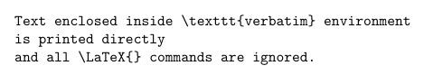

Verbatim-like text can also be used in a paragraph by means of the `\verb` command.

```tex
In the directory \verb|C:\Windows\system32| you can find a lot of Windows 
system applications. 
 
The \verb+\ldots+ command produces \ldots
```

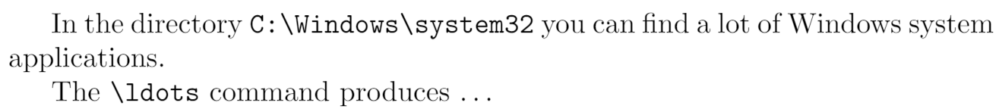

## Syntax highlighted code listing with `minted` package

Source: [overleaf.com](https://www.overleaf.com/learn/latex/Code_Highlighting_with_minted)

Note: Supports JavaScript as `js`

### List of listings

To print the list with all "listing" elements use `\listoflistings`. In the example above, 
the default title `List of listings` is changed to `List of source codes` by writing

```tex
\renewcommand\listoflistingscaption{List of source codes}
\listoflistings % Now typeset the list
```

The second page produced by the example above contains the following listing:

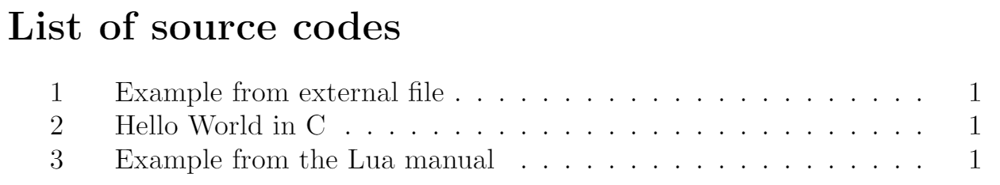


```tex
\usepackage{minted}

\begin{document}
% ...

\begin{listing}[!ht]
\inputminted{octave}{BitXorMatrix.m}
\caption{Example from external file}
\label{listing:1}
\end{listing}

\begin{listing}[!ht]
\begin{minted}{c}
#include <stdio.h>
int main() {
   printf("Hello, World!"); /*printf() outputs the quoted string*/
   return 0;
}
\end{minted}
\caption{Hello World in C}
\label{listing:2}
\end{listing}

\begin{listing}[!ht]
\begin{minted}{lua}
function fact (n)--defines a factorial function
  if n == 0 then
    return 1
  else
    return n * fact(n-1)
  end
end

print("enter a number:")
a = io.read("*number") -- read a number
print(fact(a))
\end{minted}
\caption{Example from the Lua manual}
\label{listing:3}
\end{listing}
\noindent\texttt{minted} makes a nice job of typesetting listings \ref{listing:1}, \ref{listing:2} and \ref{listing:3}.
\renewcommand\listoflistingscaption{List of source codes}
\listoflistings

% ...
\end{document}
```

## Word count

Source: 
[overleaf.com](https://www.overleaf.com/learn/how-to/Is_there_a_way_to_run_a_word_count_that_doesn%27t_include_LaTeX_commands%3F)

## Tables 

### Extra spacing between rows (vertically)

Source: 
[overleaf.com](https://www.overleaf.com/learn/latex/Questions/How_do_I_change_column_or_row_separation_in_LaTeX_tables%3F)

```tex
% A table with adjusted row and column spacing.

% \setlength sets the horizontal (column) spacing
% \arraystretch sets the vertical (row) spacing

\begingroup

\setlength{\tabcolsep}{10pt} % Default value: 6pt
\renewcommand{\arraystretch}{1.5} % Default value: 1
\begin{tabular}{ l c c }
First Row & 6 & 5 \\
Second Row & 4 & 10\\
Third Row & 20 & 30\\
Fourth Row & 100 & 30\\
\end{tabular}

\endgroup
% The \begingroup ... \endgroup pair ensures values of spacing 
% parameters only affect this particular table, and not any
% subsequent ones in the document.
```

## Quotation marks

Source: [stackexchange.com](https://tex.stackexchange.com/a/52354)

LaTeX tends to require you to use

```tex
`` <quoted text here> '' 
```

for double quotes and

```tex
` <quoted text here> '
```
